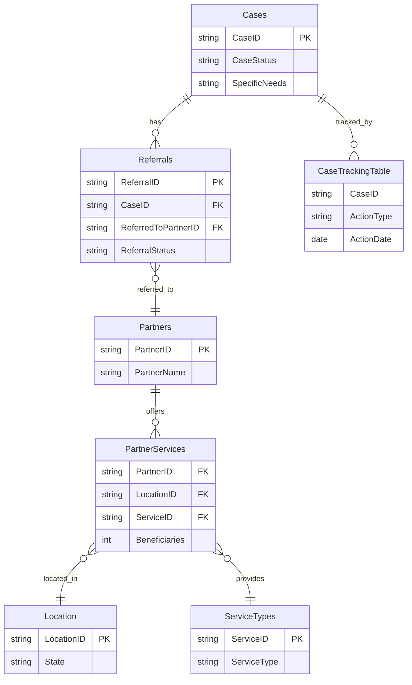

```mermaid
erDiagram
    Cases ||--o{ Referrals : has
    Cases ||--o{ CaseTrackingTable : tracked_by
    Referrals }o--|| Partners : referred_to
    Partners ||--o{ PartnerServices : offers
    PartnerServices }o--|| Location : located_in
    PartnerServices }o--|| ServiceTypes : provides
    CaseTrackingTable {
        string CaseID
        string ActionType
        date ActionDate
    }
    Cases {
        string CaseID PK
        string CaseStatus
        string SpecificNeeds
    }
    Referrals {
        string ReferralID PK
        string CaseID FK
        string ReferredToPartnerID FK
        string ReferralStatus
    }
    Partners {
        string PartnerID PK
        string PartnerName
    }
    PartnerServices {
        string PartnerID FK
        string LocationID FK
        string ServiceID FK
        int Beneficiaries
    }
    Location {
        string LocationID PK
        string State
    }
    ServiceTypes {
        string ServiceID PK
        string ServiceType
    }
```